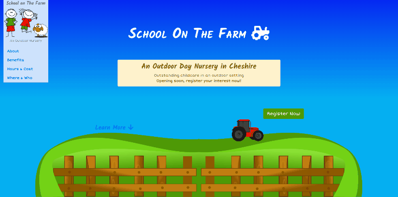

# School on The Farm Launch Site

User Centric Frontend Development Milestone Project for Code Institute

**_This project is a website designed to launch the new business of a real client in the near future. For the purposes of this submission I have used a fictitious business name, logo, and location._**

A launch website for a new outdoor nursery school business.

My client was seeking a website to advertise the upcoming launch of her new small business. The business is a nursery school offering childcare for 0-5s in an outdoor setting. There is significant competition in childcare provision around the local area so the site had to showcase the advantages of this new business over others (e.g. childcare outside on a farm setting). I have created the content based on discussions I have had with the client & a business plan she supplied.

The intention is that this launch site will be replaced by a more comprehensive website once the business is up & running (with styles and branding carried through).

## Demo

The site can be found live on [GitHub Pages](https://davebland.github.io/school-on-the-farm/).

## UX

The goal of this site is to deliver a simple but eye-catching landing page for potential customers. The site has to deliver the key information about the nursery and provide a means for potential customers to sign up for pre-registration. The content needs to be clear and concise, essentially a sales pitch for the new business. Visitors will be directed to the site from advertising via print media, word of mouth & social networks.

I have chosen to use a fully responsive single page layout as this is more straightforward for users and alludes to a small, modern business. It also feels more appropriate for a ‘launch’ site.

Initial planning was done using the 5 planes of UX design & wireframed using an online tool.

Images, bold colours and graphics chosen to convey a message of a child led, gentle, outdoor and friendly enterprise.

### User Stories

1. Potential customers arriving at the site are engaged by the content, agree with the philosophy and easily find all the information they need to convince them to complete the registration form for further information.
2. Registration form is easy to find & complete.
3. Other interested parties (e.g. local authority, Ofsted etc.) can look up the site & find an overview of what’s being offered and details of who the responsible person is.
4. Users experience appropriate, coordinated branding across the site and other media which creates good user experience and confidence in the business.
5. Site has good usability for screen reading assistance technology.

## Features

- Fully responsive, looks good on all device sizes.
- Single page, linear layout with navigation links to each page area.
- Easy to complete registration form with verification of required fields (name, email).
- Navigation element collapse at smaller screen sizes.
- Semantic layout with extra data for screen reader users where required.
- Embedded iframe to display Google Maps.
- Smooth scrolling when using nav links.

### Future Additions

- Create privacy policy to link from form.
- Add mobile share api function to footer share graphic.
- Implement smooth scrolling for IE, Edge & Safari (doesn't support CSS property).
- Add JS to cause nav menu to collapse after nav action (mobile only).

## Technologies

- HTML5
- CSS3
    - Transitions for ‘day’ graphics, social icons & page scrolling.
- Bootstrap (4.3.1)
	- Grid layout
	- Modals
	- Cards
	- Scrollspy (to track nav position)
- Font Awesome (5.8.1)
	- Icons
- Google Fonts
	- Kalam (headings)
	- Short Stack (other content)
- JavaScript
	- Bootstrap JS library

## Testing

Testing was undertaken in a variety of browsers (Chrome, Edge, IE, Firefox) to ensure that the content displayed correctly & that the form and all links worked. I also tested the site on various device sizes using Chrome developer tools.

HTML & CSS code was run through w3.org validators & any errors corrected.

### Technical Challenges

- Found navigation element remained collapsed when dynamically resizing at lg break point. Used media query to force open navigation above lg size.
- Using Boostrap row and column classes within other elements (e.g. table) worked in Chrome but not in other browsers. Moved classes out to own parent element to correct this.
- Initially set max-height of main section (100vh) to 1000px. Adjusted this to 2500px after testing on larger screens to account for possible viewing up to 4k resolution.
- Nav un-collapse above lg screen size was not working in IE, changed display property value to block to correct.

### User Story Testing

To test the user stories I asked a non-technical person to view the site and comment on whether they could clearly find the information, understand what was being offered & would sign up if it was a service they needed. Made some changes to colours and text paragraph sizes as a result of feedback.

To test good semantic layout for screen readers I experienced the site using Microsoft’s built in screen reader in Edge browser.

## Deployment

Ultimately the site will be deployed to hosting under a suitable domain name for the business.

For the purposes of this submission the site is served via GitHub Pages. The code repository is GitHub. Bootstrap (incld JS), FontAwesome & Google Fonts are externally linked.

## Credits

### Content

Content was produced by me from discussions with my client & reference to her business plan. All content would be checked and approved by my client before the site is launched commercially.

### Media

Images & graphics from royalty free and CC licence sources, predominantly PixaBay.com. Logo produced by myself.

### Acknowledgements

- wireframe.cc (online wireframing tool)
- Bootstrap official documentation
- Smooth scrolling in HTML https://www.w3schools.com/howto/howto_css_smooth_scroll.asp
- HTML5 validator https://validator.w3.org/
- CSS3 validator https://jigsaw.w3.org/css-validator/